# MEditor
## A simple mesh editor
This is one of the assignments of CIS-560 computer graphics. We are required to implement a simple mesh editor applying half-edge structure. We are also required to implement four geometry manipulation functions, including triangulate face, split edge, extrude face and Catmull-Clark subdivision. Apart from that, I also implemented mouse clicking interaction using raycasting and a bevel edge function.

### Overview

*Element Selection*
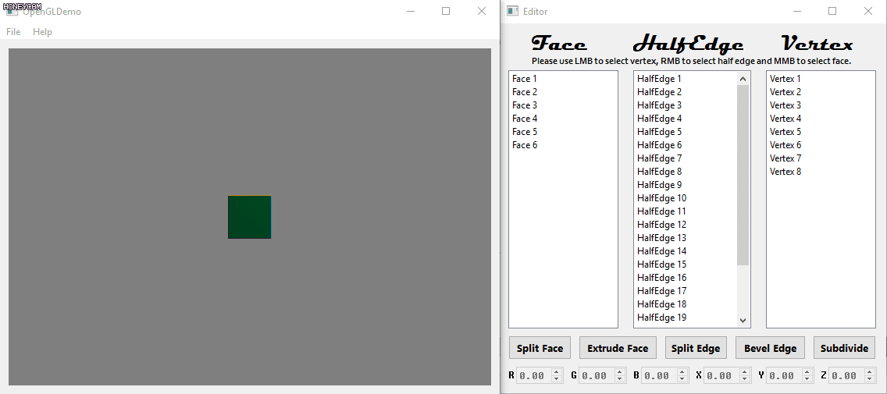

*Camera Manipulation*
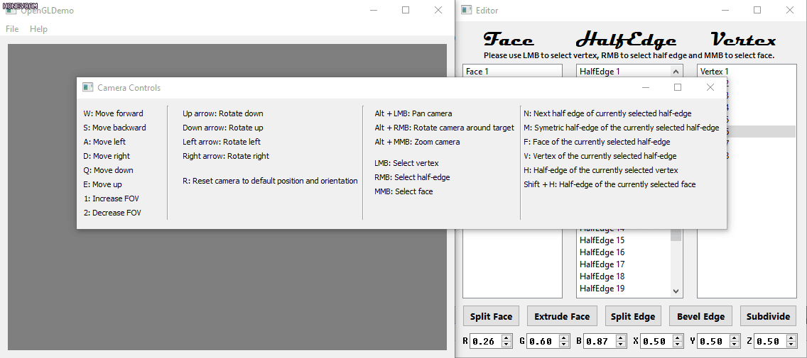

*Mouse Click Interaction*
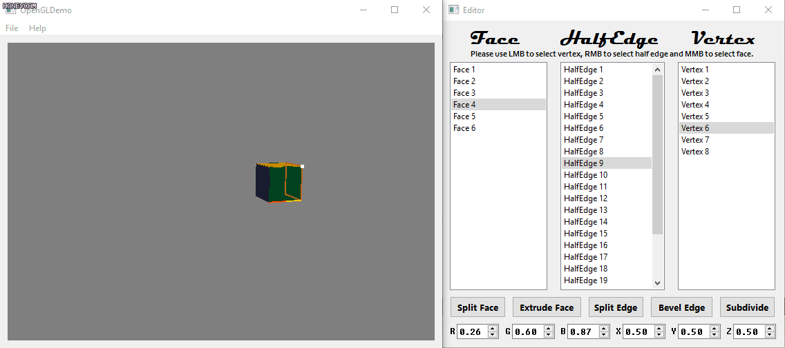

*Traverse Elements*
I pressed N -> M -> F -> V -> M -> N -> V -> H -> M -> F -> Shift+H
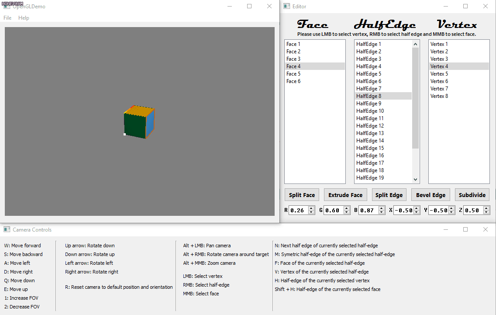

*Face Color & Vertex Position Adjustment*
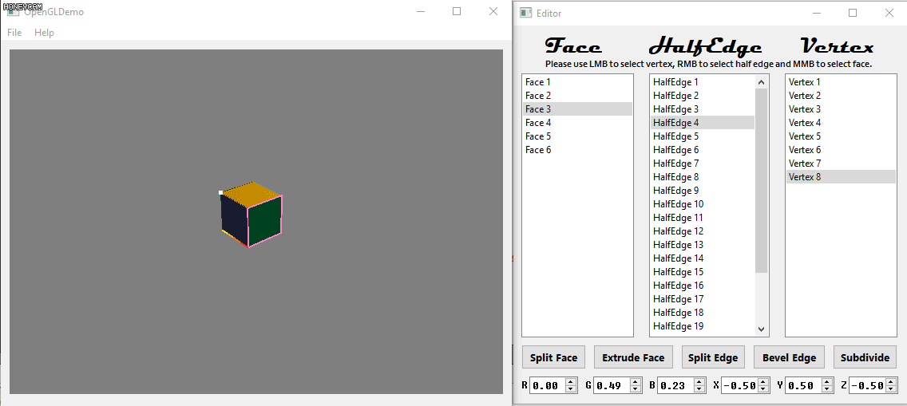

*Triangulate Face*
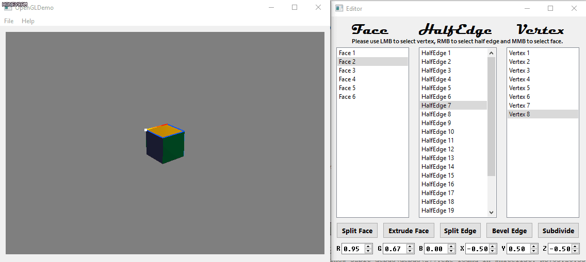

*Extrude Face*
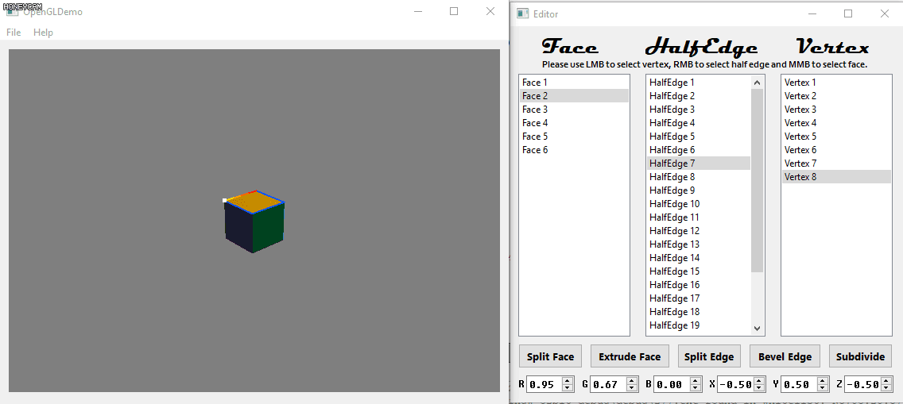

*Split Edge*
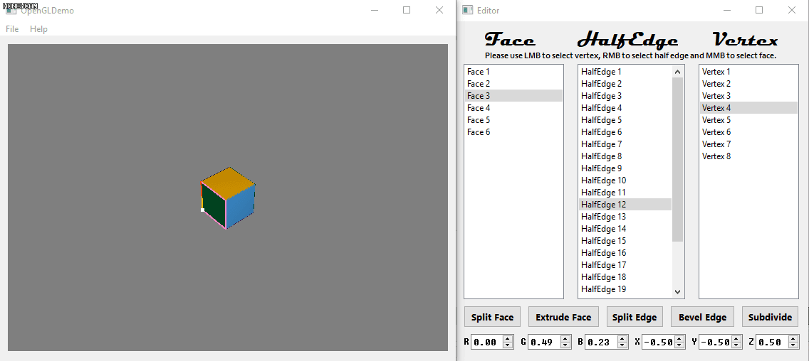

*Bevel Edge*
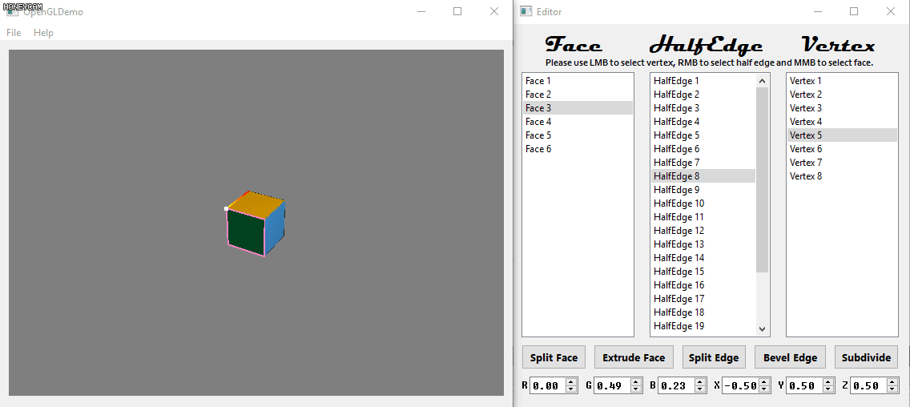

*Catmull-Clark Subdivision*
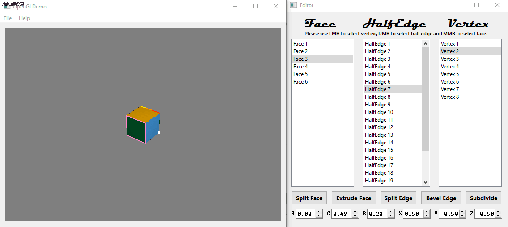

*Extrusion & Subdivision Combo*
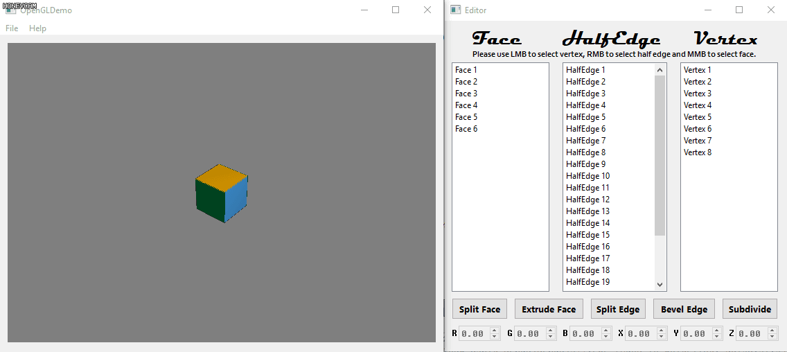

*Loading Obj File*
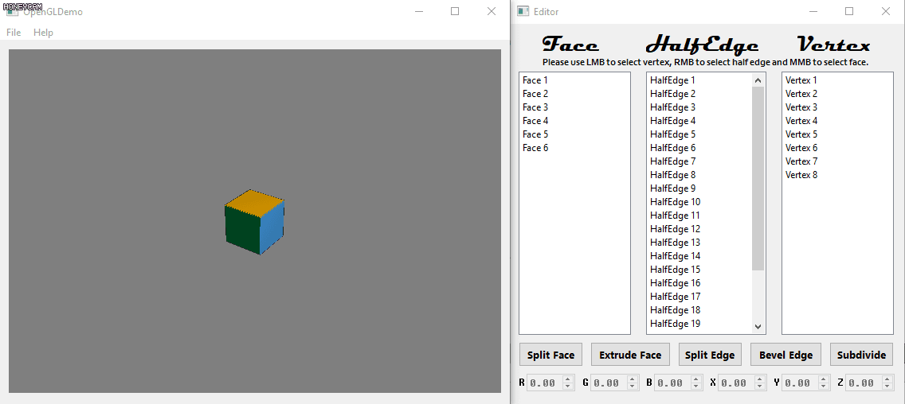